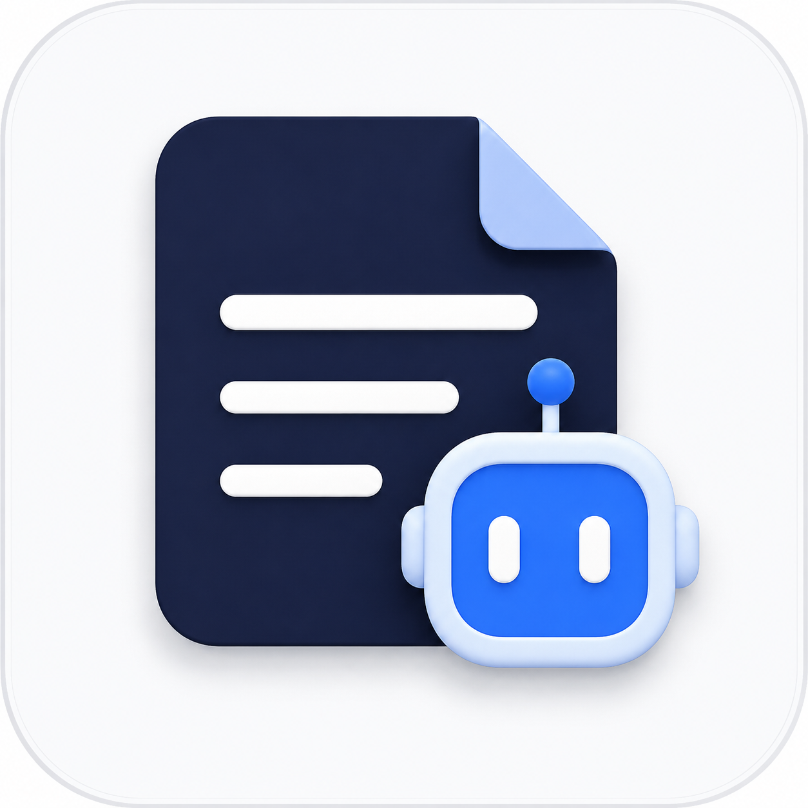

<p align="center">
  <picture>
    <source media="(prefers-color-scheme: dark)" srcset="assets/logo-darkmode.png">
    
  </picture>
</p>

<h1 align="center">ApplicationBot</h1>

<p align="center"><b>The job search that runs on your machine.</b><br>
Discovers matching openings, tailors your résumé to each one, applies for you, and tracks everything — with a dry-run safety switch so nothing is ever submitted until you say go.</p>

<p align="center">
  
  
  
  
</p>

ApplicationBot is a personalized, end-to-end job-application pipeline you run yourself. You supply
your profile, a base résumé, and filters describing the jobs you want; it finds matching postings,
customizes your résumé for each, fills out and submits the applications, and records every one. It is
built to be **downloaded and used by anyone** — nothing about you is baked into the repo; your data
lives in a local, git-ignored folder and never leaves your machine except the minimal text a
tailoring or matching call sends to Claude.

> [!WARNING]
> **Submitting an application is irreversible, so real submission is gated behind a deliberate safety switch.**
> - **Dry-run is the default.** Out of the box, ApplicationBot does everything *except* the final submit — it
>   discovers, tailors, fills the form, and records what it *would* have sent. Nothing is submitted.
> - **Arming is explicit.** Real submission happens only after you set `armed: true` in `profile/safety.yaml`
>   (with a per-run submission cap).
> - **A global kill switch stops everything.** Creating a `profile/KILL` file halts all submission immediately;
>   it is re-checked right before every click.
>
> You are responsible for how you use it. Automated applications may conflict with some job boards' terms of
> service and can put your account at risk on those sites — review each site's rules and decide what you're
> comfortable running.

---

## How it works

Five stages, each of which you can run on its own or chain into one autonomous loop:

```
Configure  →  Discover  →  Tailor  →  Apply  →  Track
```

1. **Configure** — set up your profile: contact details (including **street address** and **ZIP** —
   portals that split the address into four required boxes, such as Jobvite and BambooHR, need them;
   City and State are derived from your location), a base résumé (structured YAML, the source of
   truth), and filters (roles, keywords, location/remote, pay range, seniority, company type). Filters
   drive both what gets discovered and what gets auto-applied to. Edit it all from the web UI or in
   `profile/*.yaml`. Already have a résumé? **Upload the PDF or Word (.docx) file** in the import box at the
   top of the Profile page (LinkedIn export import lives behind a button in the same box) and
   Claude reads it into your sections — merging in anything new and leaving what you've already filled
   untouched (or import from a LinkedIn data export). Uploading a second, differently-worded résumé does
   **not** duplicate your history: a role already on file is recognised through its re-wording ("Acme
   Corp." = "Acme Corporation", "SWE Intern" = "Software Engineer Intern"), and the page names every
   entry it matched instead of adding, plus any blanks it filled in on them. A genuine second stint at
   the same employer — different years — is still kept as its own entry. The LinkedIn import dedupes
   the same way, so an export imported on top of your résumé won't re-add a job under LinkedIn's
   wording of the company name or title. Screening questions the bot couldn't answer are
   listed on the same page in the form's own controls — a dropdown question as a dropdown, and a
   **"check all that apply"** question as checkboxes, so you can pick every option that applies and all of
   them get ticked at fill time. A **Languages** section holds the languages you speak and how well
   ("Spanish — Conversational"), which forms ask for constantly and no résumé field carries: a
   *"Language Skill(s) (check all that apply)"* group gets every one of yours ticked, and a
   proficiency question gets the level for the language it names. Questions about **programming**
   languages are never answered from it.
2. **Discover** — pull openings that match your filters from public ATS APIs
   (Greenhouse · Lever · Ashby · SmartRecruiters · Recruitee · Workable), keyless aggregators
   (Adzuna · Jooble · Remotive and other JSON sources), and forwarded job-alert emails. A cheap keyword
   pre-filter narrows the pool, a two-stage judge (Haiku pre-rank → Sonnet) ranks the survivors by
   qualification fit and names your missing requirements, and a funnel view shows exactly how many
   postings reached each stage — during the auto-apply loop as well as a one-off dry run.
   A posting whose application you **never opened** is brought back by the next search rather than
   buried, so anything prepared while you were away gets a second look. When the source scout stages
   new company boards, **Add all** wires every one of them into discovery in a single click.
3. **Tailor** — Claude rewrites your résumé for each posting — selecting, reordering, and rephrasing what
   you already have. A drift check flags any skill, role, or certification that isn't in your base résumé,
   so it stays factual, and every exported PDF is re-checked to confirm its text layer is machine-readable.
   To save tokens, when a new posting demands essentially the same skills as one it already tailored for,
   it **reuses that résumé** instead of making another Claude call (use "Re-tailor" to force a fresh pass).
   A dry run can stop here: pick **Tailor the résumé only** and it searches, ranks, and tailors for the best
   match without opening a browser or touching a form — or paste a posting nobody found for you and tailor
   against that. The rendered résumé, its drift warnings, and the PDF appear right there.
   **Your own résumé outranks any generated one:** upload a PDF résumé on the Profile tab and any job whose
   demanded skills it already covers is sent that exact file — no tailoring at all. Kept résumés are listed
   under the upload box and removable in one click.
   Track, the ready-to-apply notification, and the review panel each show whether a submission used a
   **freshly tailored** résumé, a **reused** one, or **your uploaded file**, so it is never a surprise.
4. **Apply** — a real browser (Playwright) fills and submits the application through the posting's own
   ATS: Greenhouse · Lever · Ashby · SmartRecruiters · Recruitee · Workable · **Jobvite** · **BambooHR**,
   including multi-page wizards and account-gated **Workday** (automated account creation, credentials
   in your OS keychain). Portals that put the form behind an account it cannot create yet —
   **iCIMS, Taleo, Avature** — are named as needing a sign-in and parked there rather than half-filled,
   and are kept out of the search so they don't spend judging on openings that can't be applied to.
   A **honeypot** field (a box the form expects to come back empty, used to catch bots) is left alone
   and reported, never filled. Applications that get blocked (a question it can't answer, a login, a
   CAPTCHA) are *parked* so you can resolve and resume them. Every submit is gated by the safety switch above.
   A site that **refuses automated traffic** (a bot wall, e.g. DataDome's "Access is temporarily restricted")
   is reported as exactly that — not as a missing form and not as a CAPTCHA you could solve — and parked as
   **Try again**, since nothing on your side is broken. ApplicationBot never tries to get around such a wall.
   Sites word the button that opens their form differently ("Apply", "I'm interested", "Join our team"); the
   known wordings are built in, and setting `nav_agentic: true` in `profile/safety.yaml` (off by default,
   spends Claude tokens) lets a Claude worker open an unknown one **once** and remember the route, so every
   later posting on that site opens for free.
   Dropdowns don't have to spell things your way: a school picker that lists *"Penn State
   University-University Park"* still matches a résumé that says *"The Pennsylvania State University"*
   (abbreviations and typos included, main campus preferred over a branch), and when a school genuinely
   isn't in the list it picks the form's own **"Other"** — then tells you in the application's review
   panel that your real answer wasn't offered, instead of leaving a required field blank.
   Before you sign off, that **review panel** shows the exact answers it will submit — and every one of them is
   **editable**. Type over any answer (or fill in one it couldn't answer) and that value is what gets
   submitted the next time this application is filled, including the real submit; unsaved edits are saved
   for you when you click *Watch it fill* or *Apply*. Clearing a box hands the field back to the bot.
   A **"check all that apply"** question is edited there as checkboxes too — the same widget as the
   Profile page — so every option you tick is ticked on the form. A **dropdown** (or a Yes/No
   question) is edited as that dropdown, offering the form's own options, so you can't accidentally
   type an answer no option matches — and "Type a different value…" is always there when the list
   doesn't carry your answer.
   **A field whose label says nothing is read in context.** `Date`, `Name`, `Other`, *"If yes,
   please explain"* — these name a format, not a question, and the form says what they mean in the
   heading above them and the field before them. The fill reads that neighbourhood and answers from
   it: a `Date` after a **Signature** gets the day you apply, the same `Date` inside an education or
   employment block is left for you rather than stamped with today, and anything it has to ask
   Claude about is asked *with* the surrounding text so the question is the one the form is really
   asking. The review panel prints what it read under each such answer ("on the form: Applicant
   certification · follows the field: Signature").
   **Answers that don't fit their question are called out.** A filled box can still be wrong: a form's
   bottom-of-page **Date** once got *"I'm available immediately…"* — the right answer to a different
   question. Every answer is checked against the shape its question asks for (a date field answered with
   prose, a "how many" with no number, an email without an `@`, a Yes/No answered with a paragraph, a
   *which/why* answered *"Yes"*), and a mismatch turns the row amber with **Check this** and the reason
   printed right above the box that fixes it. Answers Claude drafted or picked are labelled
   **AI-drafted** / **AI-picked** for the same reason. That bottom **Date** now fills with the day you
   apply, and a native date picker is filled too.
   Every question is badged **Required** or **Optional** exactly as the form marks it, with the counts
   above the list, so you can see at a glance what actually has to be answered to submit — and the
   unanswered list says how many of *those* are required and therefore blocking. **Rescan questions**
   re-reads the live form in the background (no window opens, nothing is submitted) and refreshes the
   whole panel: the questions the posting asks now, their control types, their required marks, and the
   answers the bot produces today. Use it when a posting changes its form, or on an application prepared
   before a feature landed.
   **It also learns from your edits:** a reusable answer ("How many years of Python do you have?") is added
   to your answer bank, so the next posting that asks it is filled in instead of coming back blank — and
   an answer you correct replaces the one it got wrong. Company-specific answers ("Why Acme?") and EEO
   questions stay on that posting alone, and if the field is one your apply profile owns (email, work
   authorization) the panel says so and links you to the profile, rather than pretending it was learned.
   The web UI's **auto-apply loop** can run to a goal — *"keep going until 5 applications are ready for me"* —
   and it means it: when a pass turns up nothing new it backs off (1 min, then longer, up to 30 min) and
   searches again, each pass judging the next-best postings it hasn't scored yet, until that many are ready
   or you hit **Stop**. The status line always says how close it is and when the next pass runs, and each
   pass shows its own search breakdown — the funnel plus every posting Claude judged, accepted or denied.
5. **Track** — every application is recorded in a local SQLite database with company, role, location, pay,
   portal, status, date, fit score, and the exact tailored résumé used — viewable and editable in the Track
   tab, with funnel and calibration reports. Applied to things by hand, or before you started using this?
   Forward those emails to your linked inbox and click **Import from inbox**: every "thank you for applying"
   becomes a row, and every rejection or interview invite moves an existing one's status. Imported rows are
   flagged with the email they came from, and the whole import undoes in one click.

Discovery, tailoring, filling, and submission run with **no human in the loop** once you arm the system —
that is the point of the tool. Until then, everything is a dry run.

---

## Requirements

- **macOS** to run the prebuilt app (Apple Silicon). Any OS to run from source.
- **Python 3** for the from-source path. The prebuilt macOS app bundles its own — you need nothing installed.
- **A browser for the Apply stage** — Chromium, downloaded automatically on first run.
- **Claude, one of three ways** (for the Discover judge and Tailor stage):
  - a **Claude Pro/Max subscription** via [Claude Code](https://claude.com/product/claude-code) — recommended, not metered;
  - your own **Anthropic API key** — pay-per-token, stored in your OS keychain; or
  - **nothing at all** — the built-in `rules` engine reorders/selects by keyword with no account and no network.

---

## Install

### Option A — download the macOS app (recommended)

The easiest way to run ApplicationBot — no clone, no build, no Python.

1. Download **`ApplicationBot.app.zip`** from the **[latest release](../../releases)**.
2. Double-click to unzip, then **drag `ApplicationBot.app` into your Applications folder**.
3. **First launch only** — because the app isn't signed by an Apple-registered developer, macOS blocks it
   once. Get past it one of these ways (after that it opens normally, forever):
   - **Right-click** (or Control-click) the app → **Open** → **Open**; **or**
   - macOS Sequoia and later: open **System Settings → Privacy & Security**, scroll to
     *"ApplicationBot was blocked…"*, click **Open Anyway**, then confirm; **or**
   - in Terminal: `xattr -dr com.apple.quarantine /Applications/ApplicationBot.app`
4. Double-click to launch. It's fully self-contained (its own Python, all dependencies, the Apply-stage
   Chromium downloads quietly on first run) and reads nothing from your Documents folder. Your data lives in
   `~/Library/Application Support/ApplicationBot/`.

> The app is **ad-hoc signed** (free) — that first-launch prompt is the only cost of skipping Apple's paid
> notarization; nothing else changes.

### Option B — run from source (CLI + web UI, any OS)

For developers, or Windows/Linux users.

```bash
git clone https://github.com/Gameslayer999/ApplicationBot.git
cd ApplicationBot
./scripts/run.sh            # sets up the venv + Chromium, starts http://127.0.0.1:8000, opens your browser
```

- **Windows:** run **`ApplicationBot.bat`**. **Linux:** `./scripts/run.sh`. **macOS from source:** `ApplicationBot.command`
  (first launch: right-click → **Open**).
- The launcher is idempotent — safe to re-run any time. It creates the virtualenv, installs dependencies, and
  downloads the automation browser on first run.
- Prefer a native desktop window over a browser tab? `./scripts/run.sh --window`.

---

## Quick start

Whichever way you installed, the flow is the same:

1. **Finish setup.** Follow the in-app **✨ Finish setup** walkthrough — add your details and résumé, and choose
   which jobs to find. (From source you can instead copy the templates in [`examples/`](examples/) into `profile/`:
   `sample_resume.yaml`, `discovery.example.yaml`, `safety.example.yaml`.)
2. **Connect Claude (optional but recommended).** Sign in with Claude Code for the best tailoring on your
   subscription, or add an Anthropic API key in the bottom-left **"Claude connection"** panel. With neither, the
   free `rules` engine works with no account.
3. **Discover + dry-run apply.** The app opens on **Discover** — hit **Find & fill one application (dry-run)**
   there (or, from the CLI, `python -m applicationbot.pipeline --apply-first`). Watch it discover a match, tailor your résumé, and
   fill the form live. **It never submits.**
4. **Arm it when you're ready.** Set `armed: true` in `profile/safety.yaml` (with a submission cap) to let it
   submit for real. Drop a `profile/KILL` file to stop everything instantly.

---

## Command reference

The web UI covers everything, but each stage is also a module you can run directly.

| Command | What it does |
|---|---|
| `./scripts/run.sh [PORT]` | Set up and start the web UI (default `http://127.0.0.1:8000`) |
| `./scripts/dev.sh` | Dev mode: auto-restart on save, page auto-reloads |
| `./scripts/update.sh` / `restart.sh` / `stop.sh` | Pull latest + reinstall + restart · restart · stop |
| `python -m applicationbot.web [--port 8000]` | Start the web UI directly (stdlib, binds `127.0.0.1` only) |
| `python -m applicationbot.pipeline --apply-first` | Discover → judge → tailor → **dry-run** fill one top match |
| `python -m applicationbot.runner [--max N] [--continuous]` | Autonomous loop over every cleared match (dry-run by default). `--continuous` = a **watch**: re-checks your boards every `--interval` min and sends a desktop/phone notification each cycle a role is ready to apply |
| `python -m applicationbot.cli JD.md --resume R.yaml --out out.pdf` | Tailor a résumé to one job description (CLI) |
| `python -m applicationbot.apply URL --resume profile/resume.yaml --dry-run` | Fill one application by URL |
| `python -m applicationbot.doctor` | Read-only health check (Claude sign-in, Chromium, résumé, safety state) |
| `python -m scripts.prune_seen_ledger [--apply]` | One-time repair: drop postings from the "already shown" ledger that Claude never actually judged, so discovery can consider them again (dry-run without `--apply`) |
| `python -m applicationbot.tracker [funnel\|calibration]` | Inspect tracked applications and reports |
| `python -m applicationbot.inbox_import run [--days 30] [--limit 50]` | Import application emails from the linked inbox into the tracker; `status` shows what's been imported, `undo RUN_ID` reverses one run |
| `python -m applicationbot.mailbox link\|status\|test` | Link the bot inbox (Workday email verification, job-alert ingest, application-email import) |

**Tailoring engines** (`--backend`, defaults to `auto`):

| `--backend` | Needs | Quality |
|---|---|---|
| `claude-code` | Claude Code signed in — your **subscription**, not the metered API | Best — rewrites bullets to match the posting |
| `anthropic-api` | Your own **Anthropic API key** (OS keychain) — **metered** | Same rewriting, billed to your API account |
| `rules` | **Nothing** — no LLM, no account, no network | Reorders/selects by keyword; doesn't reword |
| `auto` (default) | — | Subscription → else API key → else rules |

> **Why can't it "log in with Claude" in the app?** Anthropic restricts subscription login to Claude Code and
> Claude.ai, so a third-party app can't use your subscription directly. The best path shells out to the Claude
> Code CLI (which *is* on your subscription); the API key is the metered fallback.

---

## Configuration & your data

Everything specific to you lives in the git-ignored **`profile/`** folder (from source) or
`~/Library/Application Support/ApplicationBot/` (the app):

- `resume.yaml` — your base résumé, the factual source of truth.
- `discovery.yaml` — filters, boards, and sources (roles, keywords, location, pay, seniority, gates).
- `safety.yaml` — the arm switch, the per-run submission cap, and the opt-in agentic fallbacks
  (`nav_agentic`, `workday_agentic` — both off by default; they spend Claude tokens to learn a site once).
- `notifications.yaml`, `mailbox.yaml` — optional desktop/phone push (also logged in the
  **Notifications** tab, so every alert is kept and dismissible) and the bot inbox link.
- `applications.db` + `applications/` — your tracked history and per-application archives.
- `uploads/` — the PDF résumés you uploaded, kept so a closely-matching job can be sent your own file
  instead of a tailored one (remove any of them under the Profile tab's upload box).
- `inbox_import_seen.json` — which inbox messages have already been imported into the tracker, so a
  re-scan never duplicates a row (and each import stays undoable).

Template versions of these live in [`examples/`](examples/). Run `python -m applicationbot.doctor` any time to
confirm your setup is healthy.

---

## Privacy & safety

Your résumé, contact details, credentials, and application history are sensitive and are treated that way:

- **Personal data never enters git.** Everything above is covered by `.gitignore` and stays on your machine.
  Only the minimal text a matching or tailoring call needs is ever sent to Claude.
- **Credentials go in your OS keychain**, never in plaintext YAML — the Anthropic API key, and any Workday
  account passwords.
- **Submission is safety-gated** — dry-run by default, explicit arming, global kill switch (see the warning at
  the top).
- **Scraping respects each site's terms and rate limits.** ApplicationBot does not build functionality whose
  purpose is to evade bot detection.

---

## Project docs

- [CLAUDE.md](CLAUDE.md) — onboarding guide and working agreement for anyone (human or agent) contributing. Read first.
- [NEXT_STEPS.md](NEXT_STEPS.md) — living build queue: current state, what's next, open decisions.
- [DECISIONS.md](DECISIONS.md) — every architecture and tooling decision with its rationale.

## Status

Actively developed. All five stages have working implementations; a few live paths (some Workday tenants, the
Adzuna apply click-through) are verified against fixtures and pending confirmation on a real residential network
— see [NEXT_STEPS.md](NEXT_STEPS.md).

## License

No license file is currently included, so default copyright applies. A license will be added before a public
release — open an issue if you need clarity in the meantime.

---

<sub>ApplicationBot is an independent, open-source project. It is not affiliated with, endorsed by, or maintained
by Anthropic; "Claude" and "Claude Code" are referenced only to describe the toolchain it runs on. There is no
associated token, cryptocurrency, or paid offering.</sub>
